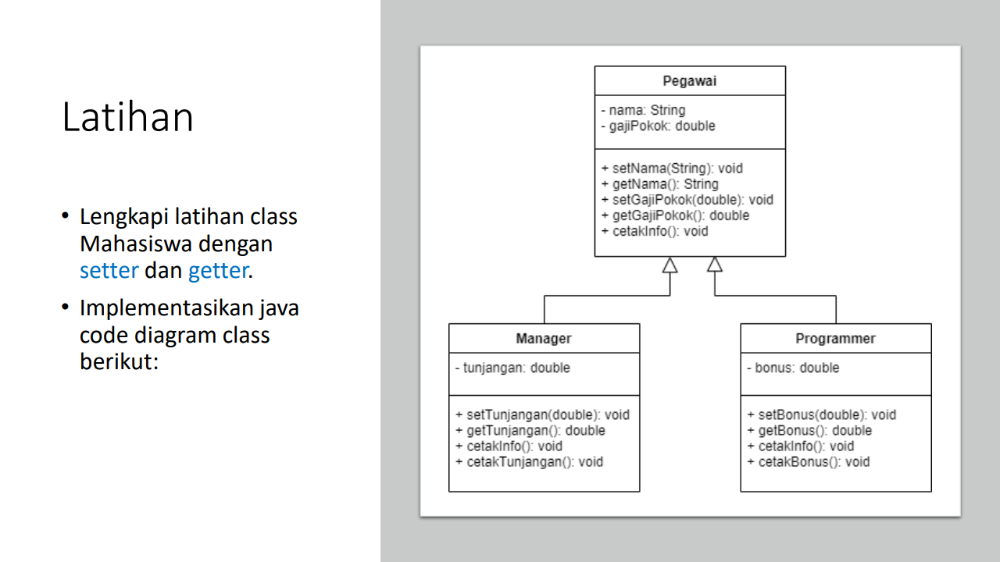
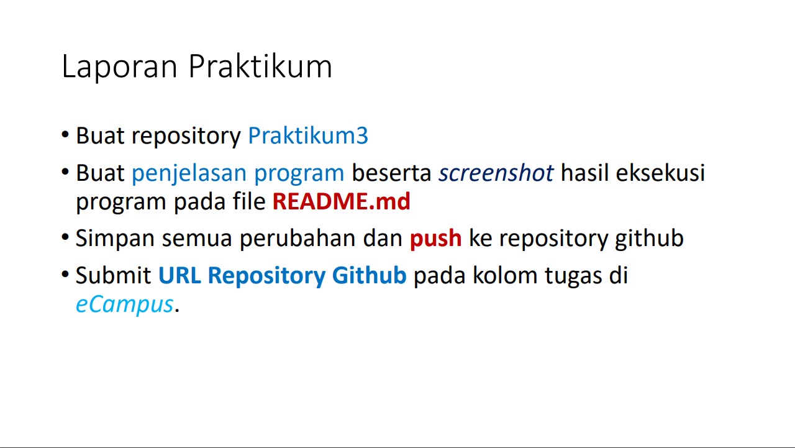
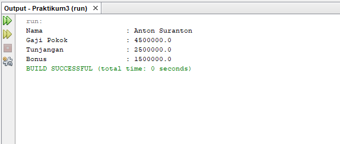

# Praktikum3

# Latihan-Tugas

<p><b> Nama    :   Afra Nesya Apriyanthi </p>
<p><b> NIM     :   312110614 </p>
<p><b> Kelas   :   TI.21.C1 </p>
<p><b> Mata Kuliah : Pemrograman Orientasi Objek</p>
<p><b> Tugas Pertemuan 6 </p>


<p> Berikut soal dari latihan  <p>




berikut script javanya
Pegawai.java

```java
public class Pegawai {
	String nama;
	double gajiPokok;	
	
	
	public void cetakInfo() {
		System.out.println("Nama 			: " + this.nama);
		System.out.println("Gaji Pokok	 	: " + this.gajiPokok);	
	}
}
```

selanjutnya membuat java baru dengan nama Manager.java

```java
public class Manager extends Pegawai {
	double tunjangan;
	
	//Cetak Bonus
	public void cetakTunjangan(){
		System.out.println("Tunjangan		: " + this.tunjangan);
	}
}
```

selanjutnya membuat java baru dengan nama Progammer.java

```java
public class Programmer extends Pegawai {
	double bonus;
	
	//Cetak Bonus
	public void cetakBonus(){
		System.out.println("Bonus               	: " + this.bonus);
	}
}
```

dan terakhir membuat java baru dengan nama PegawaiBeraksi.java

```java
public class PegawaiBeraksi {
	public static void main(String[] args){
		//Membuat object
                Programmer antonBonus = new Programmer();
		Manager anton = new Manager();

		
		/* memanggil atribut dan memberi nilai */
		anton.nama = "Anton Suranton";
		anton.gajiPokok = 4500000;
		anton.tunjangan = 2500000;
                antonBonus.bonus= 1500000;

		
		anton.cetakInfo();
		anton.cetakTunjangan();
                antonBonus.cetakBonus();
	}
}
```

<p> Maka hasil outputnya adalah<p>


