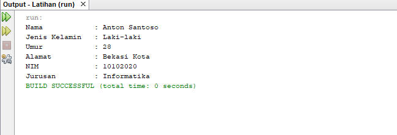

# Latihan-Tugas

<p><b> Nama    :   Afra Nesya Apriyanthi </p>
<p><b> NIM     :   312110614 </p>
<p><b> Kelas   :   TI.21.C1 </p>
<p><b> Mata Kuliah : Pemrograman Orientasi Objek</p>
<p><b> Tugas Pertemuan 6 </p>


<p> Berikut soal dari latihan  <p>


berikut script javanya
Manusia.java

```java
public class Manusia {
	String nama;
	String jenisKelamin;
	int umur;
	String alamat;
	
	public void setnama(String nama) {
		this.nama = nama;
	}
	public String getnama(){
		return this.nama;
	}

	
	public void setjenisKelamin(String jenisKelamin) {
		this.jenisKelamin = jenisKelamin;
	}
	public String getjenisKelamin(){
		return this.jenisKelamin;
	}
	
	
	public void setumur(int umur) {
		this.umur = umur;
	}
	public int getumur(){
		return this.umur;
	}
	
	
	public void setalamat(String alamat) {
		this.alamat = alamat;
	}
	public String getalamat(){
		return this.alamat;
	}
	
	public void cetakInfo() {
        System.out.println("Nama            : " + this.nama);
        System.out.println("Jenis Kelamin   : " + this.jenisKelamin);
        System.out.println("Umur            : " + this.umur);
        System.out.println("Alamat          : " + this.alamat);
    }
}
```

selanjutnya membuat java baru dengan nama Mahasiswa.java

```java
public class Mahasiswa extends Manusia {
	String nim;
	String jurusan;

	public void setnim(String nim) {
		this.nim = nim;
	}
	public String getnim(){
		return this.nim;
	}
	
	public void setjurusan(String jurusan) {
		this.jurusan = jurusan;
	}
	public String getjurusan(){
		return this.jurusan;
	}
	
	public void cetakInfo2() {
        System.out.println("NIM             : " + this.nim);
        System.out.println("Jurusan         : " + this.jurusan);
    }
}

```

dan terakhir membuat java baru dengan nama MahasiswaBeraksi.java
```java
public class MahasiswaBeraksi {
	public static void main(String[] args){
		// Membuat object
		Mahasiswa anton = new Mahasiswa();
		
		
		/* memanggil atribut dan memberi nilai */

		anton.setnim ("10102020");
		anton.setnama ("Anton Santoso");
		anton.setjenisKelamin ("Laki-laki");
		anton.setumur (28);
		anton.setalamat ("Bekasi Kota");
		anton.setjurusan ("Informatika");
                
		anton.cetakInfo();
        	anton.cetakInfo2();
		}

}
```

<p> Maka hasil outputnya adalah<p>




berikut script javanya
Pegawai.java

```java
public class Pegawai {
	String nama;
	double gajiPokok;	
	
	
	public void cetakInfo() {
		System.out.println("Nama 			: " + this.nama);
		System.out.println("Gaji Pokok	 	: " + this.gajiPokok);	
	}
}
```

selanjutnya membuat java baru dengan nama Manager.java

```java
public class Manager extends Pegawai {
	double tunjangan;
	
	//Cetak Bonus
	public void cetakTunjangan(){
		System.out.println("Tunjangan		: " + this.tunjangan);
	}
}
```

selanjutnya membuat java baru dengan nama Progammer.java

```java
public class Programmer extends Pegawai {
	double bonus;
	
	//Cetak Bonus
	public void cetakBonus(){
		System.out.println("Bonus               	: " + this.bonus);
	}
}
```

dan terakhir membuat java baru dengan nama PegawaiBeraksi.java

```java
public class PegawaiBeraksi {
	public static void main(String[] args){
		//Membuat object
                Programmer antonBonus = new Programmer();
		Manager anton = new Manager();

		
		/* memanggil atribut dan memberi nilai */
		anton.nama = "Anton Suranton";
		anton.gajiPokok = 4500000;
		anton.tunjangan = 2500000;
        antonBonus.bonus= 1500000;

		
		anton.cetakInfo();
		anton.cetakTunjangan();
        antonBonus.cetakBonus();
	}
}
```

<p> Maka hasil outputnya adalah<p>


